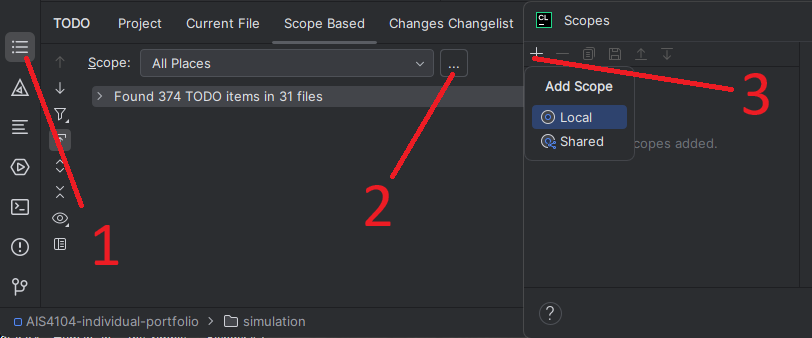
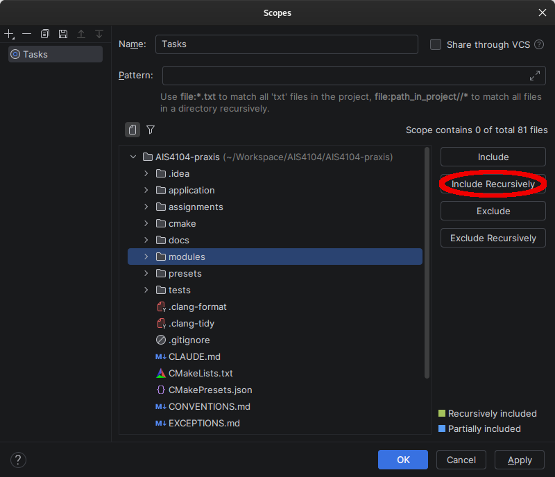
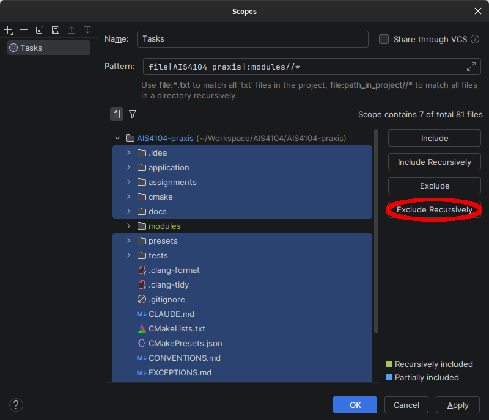

## Assignment 1

All your code in this assignment should land inside `modules/rigid_motion/frame.cpp` or `modules/rigid_motion/screw.cpp`.

There are two CMake targets of relevance: 
1. `assignment_1_presets`: your code (in `frame.cpp` and `screw.cpp`) is used in these presets.</br>
2. `rigid_motion_presets`: presets with reference behavior that can be used to visualize topics of the book, or expected behavior for your assignment.

### Tests

The target `assignment_1_tests` can be ran to verify your code correctly implements the tasks according to the book.

`assignment_1_baseline_tests` is a second, optional target. It does not run under `ctest`; run it by name, with
the argument `"[.extended]"`. Rather than checking the frozen rows `assignment_1_tests` uses, it compares every one
of your functions against the reference over a thousand randomly drawn inputs, and reports the largest disagreement
it found for each. Use it when a task passes `assignment_1_tests` but you want to know whether it holds up away from
those rows. Everything it finds is reported as a warning; the run passes either way, so read the warnings rather
than the verdict. A disagreement near a half turn is expected, as the book's formulas lose accuracy there, which is
a property of the mathematics rather than a mistake in your code. A warning that a task "answered non-finitely"
means some drawn input drove your code to infinity or to not-a-number. The book decides its cases on exact
conditions such as "if R = I" and says nothing about how to decide them in floating point, so two reasonable
choices of test can leave a narrow band of inputs that neither case handles. Such a warning tells you where that
band is in your own code.

### Agentic coding and LLM assistance
Read the handout PDF requirements on the use of LLMs -- the handout states requirements and guidelines, 
whereas the files `docs/AGENTS.assisted.md` or `docs/AGENTS.socratic.md` dictate the LLM to act depending on how you wish to use LLMs for assistance.
Similarly, if relying on LLM services through webpages, rename the file you wish to use to `PRE-PROMPT.md` and upload it along with your initial prompt to the LLM. 
Ensure you get the history / prompt log artifact once you're finished with the session.

### Do not alter function signatures, file names or locations
Do not change return types, parameters or names of a function!
Do not move functions between files or move files in the project. 

You should only add code inside existing function bodies. 
However, you can add your own classes and types of you wish, but never modify the code architecture from the handout.

Submit source only — `build/`, `cmake-build-*/` and `.idea/` stay out. The `.gitignore` already lists them.

### Tasks

The tasks for the assignment are listed in the PDF handout, but the TASK-labels can be listed by CLion using the TODO-plugin.
Please note that the TASK-labels list may not be exhaustive, and that the assignment document takes precedence on  
tasks for the submission.

To show TASK-labels in CLion, add the following pattern under Settings->Editor->TODO->Patterns.

```
\btask\b.*
```

Then, create a custom named local scope of the TODO plugin to look for tags. Name it `Tasks`, `Assignment` or something similar. 
<p float="left">

</p>

Then, select the modules/ folder and click `Include recursively`.
<p float="left">
 
</p>

Similarly, to ensure documentation and assignment scaffolding files are omitted, select all folders, untick modules/ and click `Exclude recursively`. 
The configuration should be color highlighted as shown below. Afterwards, in the TODO-window, you should see 29 items under "Tasks" spread over two files, `modules/rigid_motion/frame.cpp` and `modules/rigid_motion/screw.cpp`.
<p float="left">

</p>


### Reading a test failure

```
task 1e - frame.rotate_y case 0 residual 3.141593e+00 / 0.000000e+00 allowed 1.000000e-13 / 1.000000e-13
```

`1e` is the task, `frame.rotate_y` the function to write, `case 0` which of its inputs was used.
The `residual` pair is how far your answer landed from the expected one — a magnitude, then a
linear error in metres — and `allowed` is how far each may land. An unwritten function misses by a
wide margin. A near miss is usually degrees where radians were wanted, or a matrix the wrong way
round.

### Building

| Platform | Toolchain |
|---|---|
| Windows | Visual Studio 2022 Build Tools with the C++ workload, or the MinGW toolchain CLion bundles |
| Linux | GCC or Clang, plus your distribution's OpenGL and X11/Wayland development packages |
| macOS | Xcode Command Line Tools |

The first configure downloads dependencies and needs network. Budget roughly 30 seconds to
configure, 3 minutes to build, and 2 GB of disk. This was measured on a desktop restricted to four cores
and the numbers are a floor, not an average; an older laptop or a slow connection takes several times as long.
Every build after the first will recompile only what you changed.

Run `assignment_1_tests` from the run configuration dropdown at the top right. On a fresh checkout
every task fails; that is what subtask 1.a) asks you to verify.

The project builds with around 46 `-Wunused-parameter` warnings in `frame.cpp` and `screw.cpp` under
GCC and Clang; MSVC counts and names them differently. That is expected on an unimplemented
checkout — each one goes away as you fill in the task below it.

### Build issues or system hangup

**The build runs out of memory.** It compiles four files at once and peaked at 1.9 GB. Lower the
parallel job count under `Settings | Build, Execution, Deployment | Toolchains`.

**The first configure fails while downloading.** Check the network, then `File | Reload CMake
Project`. If a download was cut off, delete `build/` or `cmake-build-*` and configure again.
